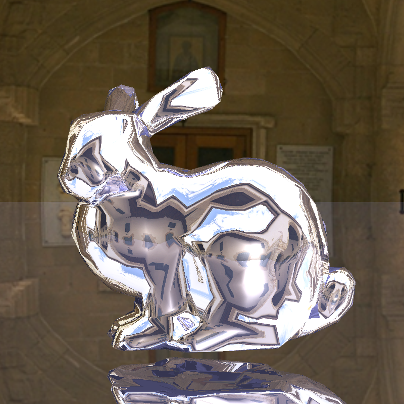
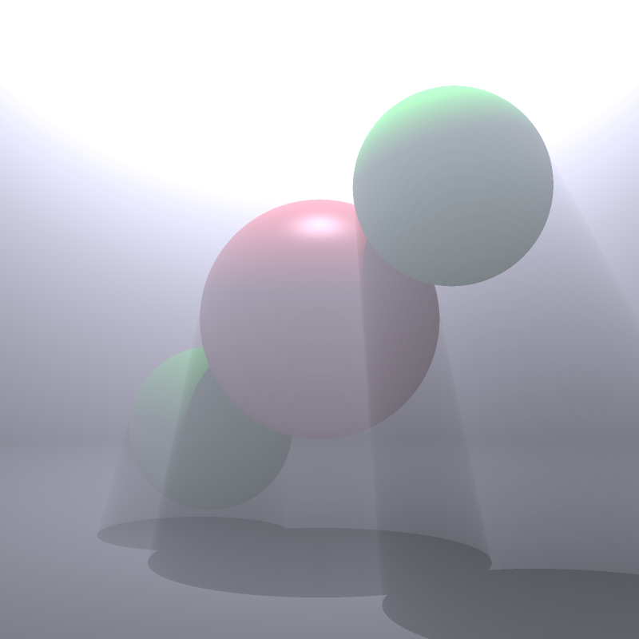
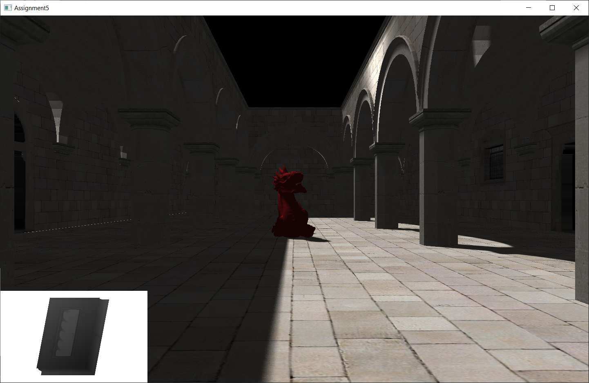

This repository contains a few of my solutions to problem sets from MIT's 6.837 - Computer Graphics, from the Fall 2020 semester. Starter code was provided by the instructor, [Professor Justin Solomon](https://people.csail.mit.edu/jsolomon/).
Instructions for running assume that the user is `cd`'d into the relevant directory for the assignment, and all paths are given relative to the that same directory.

## Assignment 2 - Animation

This assignment implements linear blend skinning.

Run with `./assignment2.exe {model name}`, where `model name` is the name of a model in `assets/assignment2`, without an extension.
e.g., to display the model with vertices in `Model1.obj`, bones in `Model1.skel`, and skinning weights in `Model1.attach`, run `./assignment2.exe Model1`.

[Demo](https://youtu.be/p4owaHM04Tc)

## Assignment 3 - Physical Simulations

This assignment implements RK4 (Runge-Kutta 4)-based integration, allowing for multiple simulations. These can be run with `./assignment2.exe {integrator} {timestep}`, where `integrator` is `e` for forward euler, `t` for trapezoidal, or `r` for RK4, and `timestep` is measured in seconds.

Below is a demonstration of mass-spring based cloth using this system (run with `./assignment3.exe r 0.005`). The cloth uses 3 types of springs: structural, shear, and flexion.

[Demo](https://youtu.be/Yf3j33bmgSg)

## Assignment 4 - Raytracing

Path tracing on simple primitives (spheres, cuboids, aand triangles).

Running:
`./assignment4 -input {scene_file_name} -output {out}.png -size {width} {height}`, where `scene_file_name` is found in `assets/assignment4` (e.g. `scene06_bunny_1k.txt`).

Flags:
Supersampling: `-supersample {x}` where x > 1
Sample jittering: `-jitter`
Shadows: `-shadows`
Reflection/indirect lighting: `-bounces {n}` for a maximum of `n` light bounces

Volumetric fog is implemented by raymarching and sampling lighting through "empty" space between the surface and the camera. It can be demonstrated by running the scene `scene09_volumetric_fog.txt` with the `-shadows` flag.

## Assignment 5 - Shadow Mapping

This assignment implements depth-based shadow mapping. I also added percentage-closer filtering for soft shadows, using per-pixel hash-based noise for antialiasing.

Shadow rendering, including PCF - `gloo/shaders/phong.frag`

[Demo with moving lights](https://youtu.be/21WEQ1LYQHE)

